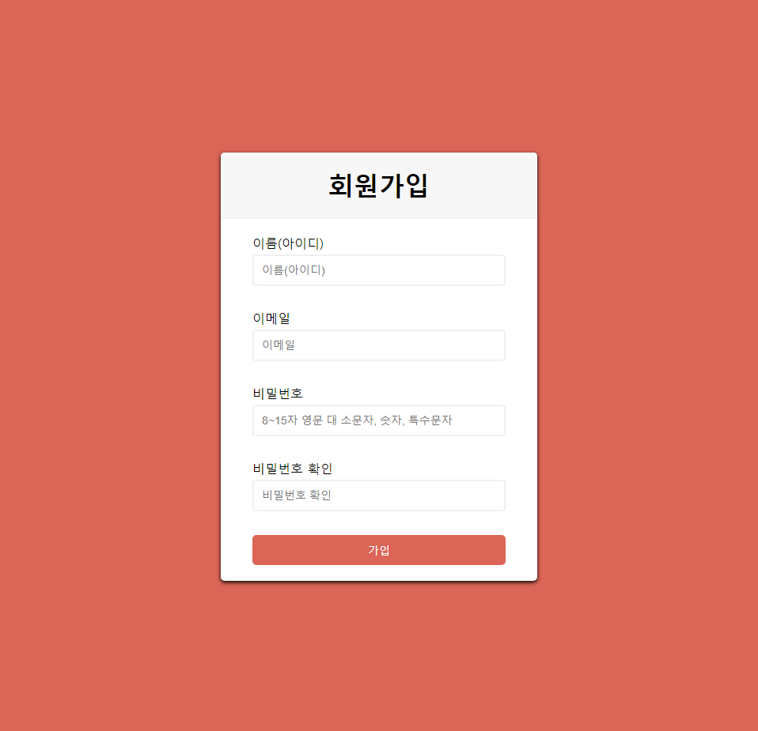
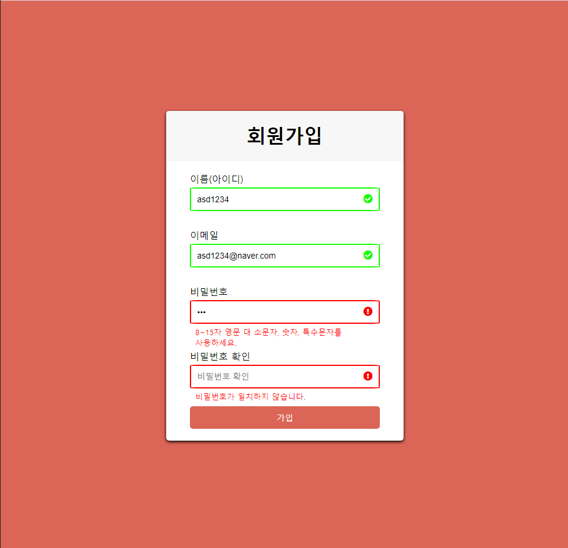

# Form Validation

- 회원가입 폼 유효성 검사 기능 구현

## 주요 기능

### 1. 유효성 검사

- `input` 에서 `focusout` 시 유효성 검사 기능

### 2. 에러 메시지 출력

- 공백 또는 잘못된 형식으로 입력하면 에러 메시지 출력

## 구동 화면




## 소스 코드

- `isEmail` 함수를 사용해서 이메일 유효성 검사

```js
    // 이메일
    else if(formControl.querySelector('input').className === 'emailInput'){
        if(target.value === "" || target.value === null){
            small.innerText = "필수 정보입니다.";
            target.parentNode.className = 'form-control error';
        }
        else if(!isEmail(target.value)){
            small.innerText = "이메일 형식으로 입력해주세요.";
            target.parentNode.className = 'form-control error';
        }
        else{
            target.parentNode.className = 'form-control success';
        }
    }

// ...
function isEmail(email){
    let emailRegExp = new RegExp(/^(("[\w-\s]+")|([\w-]+(?:\.[\w-]+)*)|("[\w-\s]+")([\w-]+(?:\.[\w-]+)*))(@((?:[\w-]+\.)*\w[\w-]{0,66})\.([a-z]{2,6}(?:\.[a-z]{2})?)$)|(@\[?((25[0-5]\.|2[0-4][0-9]\.|1[0-9]{2}\.|[0-9]{1,2}\.))((25[0-5]|2[0-4][0-9]|1[0-9]{2}|[0-9]{1,2})\.){2}(25[0-5]|2[0-4][0-9]|1[0-9]{2}|[0-9]{1,2})\]?$)/i);
    return emailRegExp.test(email);
}
```
